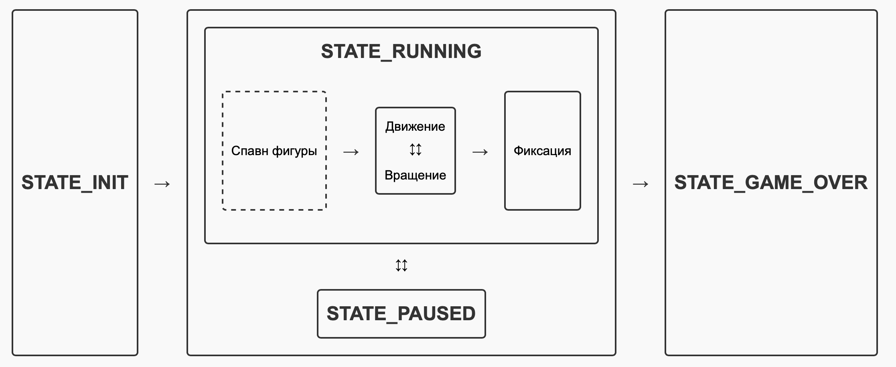

# Документация по игре "Тетрис"

## Введение
Игра "Тетрис" представляет собой головоломку, в которой игрок должен располагать падающие блоки, состоящие из четырех квадратов (тетромино), чтобы собирать заполненные линии, которые затем уничтожаются.

Цель игры — набрать как можно больше очков, уничтожая линии.

## Особенности
- Вращение фигур.
- Горизонтальное перемещение фигур.
- Ускорение падения фигур.
- Предпросмотр следующей фигуры.
- Начисление очков за уничтожение линий.
- Механика уровней с увеличением сложности.

## Игровые состояния (конечный автомат)
Логика игры реализована с использованием конечного автомата (КА), который управляет различными состояниями игры. Ниже описаны основные состояния и возможные переходы между ними.

### Основные состояния:

## Информация об игре
В игре "Тетрис" поддерживаются следующие игровые механики:
- Фигуры могут перемещаться влево и вправо, а также вращаться.
- Падение ускоряется при нажатии стрелки вниз.
- При заполнении ряда блоками он уничтожается, и игроку начисляются очки.
- Игра заканчивается, когда блоки достигают верхней границы игрового поля или игрок нажимает кнопку 'q'.

## Подсчет очков
В игре "Тетрис" очки начисляются следующим образом:
- 1 линия — 100 очков
- 2 линии — 300 очков
- 3 линии — 700 очков
- 4 линии — 1500 очков

## Механика уровней
Игрок начинает с 1 уровня. За каждые 600 очков уровень повышается, увеличивая скорость падения фигур. Максимальный уровень — 10.

## Заключение
Игра "Тетрис" реализована с использованием конечного автомата для управления состояниями игры, что упрощает разработку и отладку. Благодаря этому механизму, игра обрабатывает действия пользователя и управляет игровым процессом эффективно.
